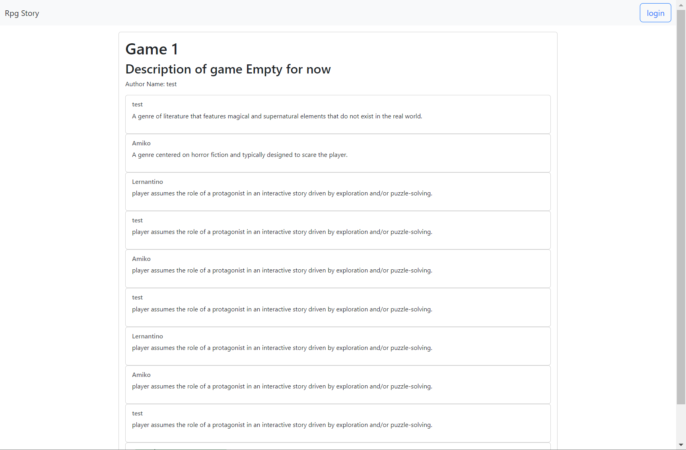

# RPG-journey-Game

### Website live URL : [https://rpg-game-lpanz.herokuapp.com/]
### GitHub repository: [https://github.com/louieiply/RPG-journey-Game]

## User Story:

- As a RPG enthusiast 

- I WANT to share RPG story ideas with other people

- SO THAT we can build a story together that all will enjoy playing through

## Description: 
Running an RPG for your friends and you want it to be otherworldly! You have hit your niche.

Our app allows people to come together and create stories together as well as view other peoples work to foster a creative environment for idea propagation.

## Usage:
RPG-journey-Game allows users to sign up and sign in their account to the forum and then to creat their story and post their ideas to online forums: The game with title and discription is created by the author, and other players can the add more ideas or give a comment.

If the user enter their own account. Then they can edit their personal adventure session. Otherwise, RPG-journey-Game will display adventure avaible in the category.

The game story is completed by everyone, therefore, we can create a game that will be loved by everyone.

## screenshot:
  
## Applications used:
- Node.Js
- Express.Js
- Handlebars.js
- MySQL
- Sequeize ORM

## Credits:
- Peter Jolley
- Zekun Chen
- Alessia Belperio
- Louie Lp
- Nan Wang
